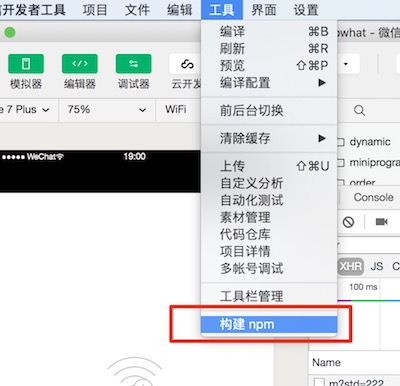

[](https://www.npmjs.com/package/@areslabs/alita)
[](https://www.npmjs.com/package/@areslabs/alita)
[](https://www.npmjs.com/package/@areslabs/alita)

# Alita
Alita是一款把React Native转化为微信小程序的引擎，它对React语法有全新的处理方式，更多的是在运行时处理React语法，它可以把你的React Native应用转化为
微信小程序代码，实现React Native和微信小程序之间的打通。  

更少的代码，等于更少的bug，等于更少的工作量。

另外，虽然我们说这是一个把React Native应用转化为微信小程序的引擎，但是换一个角度，也可以把它看成是提供React开发微信小程序应用的方式。 相比与微信小程序，React更加的自由，对组件化有着更为强大的支持， 封装和复用代码的方式更加的多样。所以，如果你喜欢React的开发方式， 你完全可以把这个转化引擎当成是React Native对微信小程序端的扩展，即使没有APP端的需求， 也可以使用React Native开发最终通过我们的引擎使其运行在微信小程序端。
 
<table>
   <tr>
   	    <td>React Native</td>
   	    <td>微信小程序</td>
   </tr>
	<tr>
		<td></td>
		<td></td>
	</tr>
</table>


## Install
通过npm安装即可

`npm install -g @areslabs/alita`

## Getting Started
我们在[examples](https://github.com/areslabs/alita/tree/master/examples)目录提供了丰富的样例代码，包括HelloWorld， Todo， ReactRepos。 强烈建议你clone出一份，然后使用Alita转化，你可以在上面尝试任何你想要的功能。 


当然你也可以建立自己的RN应用，进行转化。

1. 建立React Native应用 HelloWorld
    ```
    react-native init HelloWorld
    ``` 
    构建你的页面，路由需要使用[@areslabs/router](./docs/路由.md)
 
2. 调用alita命令将其转化为微信小程序应用
    ```
    alita -i HelloWorld -o HelloWorldWP
    ```

3. 进入`HelloWorldWP` 目录， 安装相关依赖
    ```
    cd HelloWorldWP
    npm install
    ```

4. 运行`HelloWorldWP`代码
   使用微信开发者工具在`HelloWorldWP`目录 [创建小程序](https://developers.weixin.qq.com/miniprogram/dev/quickstart/basic/getstart.html#%E8%B5%B7%E6%AD%A5)
  
   **Alita生成的小程序使用了小程序的npm功能， 所以需要在下图的地方点击构建npm**
   
   

这样你新建的React Native应用就运行在了微信小程序


**注意**一般我们有两种方式创建React Native应用，一种是使用react-native命令， 另一种是使用expo。 这两种方式Alita都可以转化，但是不管是哪一种方式
创建的项目，都会在项目根目录创建App.js， App.json文件。但是这两个文件在微信小程序平台有特别的意义，所以必须对这两个文件**重新命名**。 
react-native 命令创建的项目只需要把App.js 重命名比如RNApp.js即可， 而expo的方式需要[参考](https://docs.expo.io/versions/latest/sdk/register-root-component/#what-if-i-want-to-name-my)

另外， React Native命令默认会创建最新的版本，而目前最新的 0.45 及以上版本需要下载 boost 等几个第三方库编译。这些库在国内即便翻墙也很难下载成功，导致很多人无法运行iOS项目！！！中文网在论坛中提供了这些库的[国内下载链接](http://bbs.reactnative.cn/topic/4301/ios-rn-0-45%E4%BB%A5%E4%B8%8A%E7%89%88%E6%9C%AC%E6%89%80%E9%9C%80%E7%9A%84%E7%AC%AC%E4%B8%89%E6%96%B9%E7%BC%96%E8%AF%91%E5%BA%93-boost%E7%AD%89)

## 命令行参数
alita命令有以下参数：

1. -v  打印alita 版本
2. -i  React Native 源代码目录
3. -o  转化生成的小程序源代码目录
4. --config 指定配置文件

## Examples
[HelloWorldExpo](https://github.com/areslabs/alita/tree/master/examples/HelloWorldExpo), Expo命令创建的项目，转化出来的小程序在[HelloWorldWP](https://github.com/areslabs/alita/tree/master/examples/HelloWorldExpoWP)

[HelloWorldRN](https://github.com/areslabs/alita/tree/master/examples/HelloWorldRN), react-native 命令创建的项目。 代码逻辑同[HelloWorldExpo](https://github.com/areslabs/alita/tree/master/examples/HelloWorldRNWP)

[Todo(redux实现)](https://github.com/areslabs/alita/tree/master/examples/Todo)，react-native 命令创建的项目，转化出来的小程序在[TodoWP](https://github.com/areslabs/alita/tree/master/examples/TodoWP)

[ReactRepos](https://github.com/areslabs/alita/tree/master/examples/ReactRepos)，react-native 命令创建的项目，转化出来的小程序在[ReactReposWP](https://github.com/areslabs/alita/tree/master/examples/ReactReposWP)

[SubpackagesDemo](https://github.com/areslabs/alita/tree/master/examples/SubpackagesDemo)， 通过[小程序分包集成的方式](./docs/小程序分包集成.md)，集成的小程序包


## 要求与限制
主要有3个方面的要求和限制

1. 转化之后的小程序，必须符合小程序的规范， 比如最终压缩的代码小于4m，分包8m， 路由深度不大于5层等。

2. Alita本身的一些限制 详见[要求与限制](./docs/要求与限制.md)， [静态限制](./docs/静态限制.md)

3. 如果使用了第三方React Native组件，需要使用[自定义组件库扩展](./docs/自定义组件库扩展.md) 方式进行扩展


## 配置文件
Alita可以通过参数`--config`指定一个配置文件。当你的项目只使用了React Native官方组件和API的时候，这个配置文件是可以忽略的，使用系统默认配置就可以，但是当你的React Native应用足够复杂的，就需要使用配置文件了。[具体可见](./docs/配置文件.md)

## eslint检查
虽然Alita支持了大部分的React语法，但是还是有一些情况Alita无法处理，比如原生RN动画库。另外Alita在转化代码的过程中，使用了一些保留字。我们希望这些来自Alita的限制可以近早的被发现，所以我们提供了一个eslint plugin。通过配置此plugin，可以让你在使用Alita转化代码之前，对你的代码进行静态的检查。[详见](./docs/代码检查&Eslint.md)

## 已有RN项目转化
Alita的设计目标是要尽可能无损的转换RN应用，即使是已经存在的RN应用。但是不可避免的，已有项目会更多的触及到Alita的限制，包括路由组件，动画组件。当你需要转化已有项目时，可以[参考这里](./docs/老项目转化.md)， 它总结性的提出了老项目需要注意和修改的点

## License
MIT
