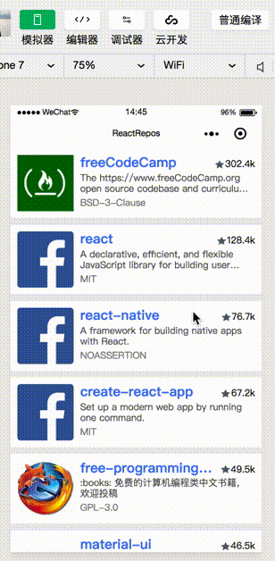
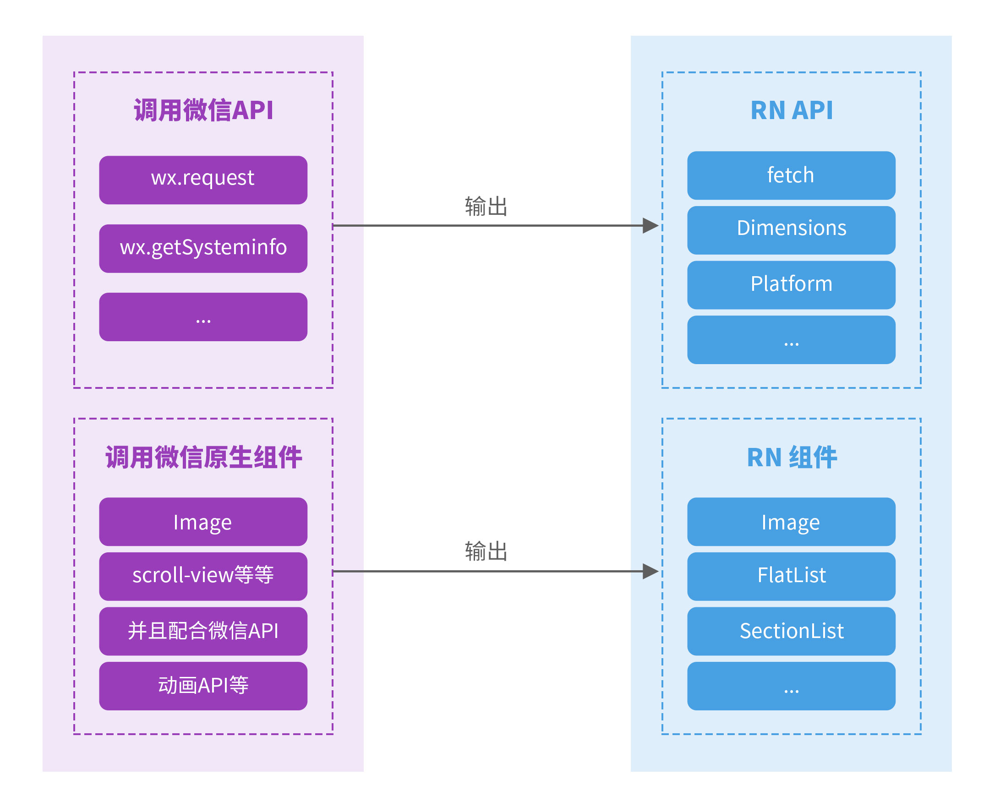
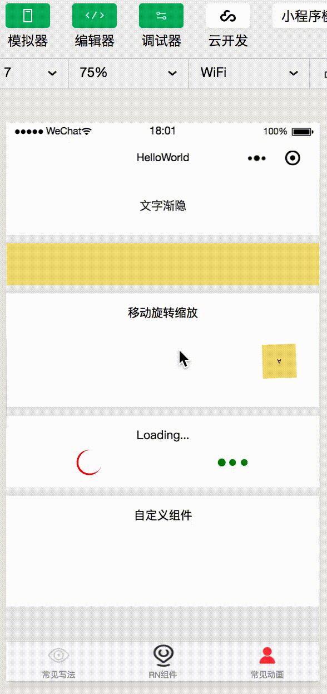

# 战斗天使来袭！RN转微信小程序引擎Alita正式开源！


### 前言

Alita 是由ARES Labs打造的一款 React Native（下文简称 RN ） 转换为微信小程序的通用转换引擎，其对React语法有全新的处理方式，并在微信小程序平台扩展了RN组件，实现了RN和微信小程序生态的打通。

随着微信小程序的火爆发展，很多业务都同时有APP端和微信小程序端的需求，如果我们每一端都单独编写一套代码，那么就需要三个开发团队：Android 团队、IOS 团队以及微信小程序团队，成本非常高。FaceBook 发布的 RN 可以让开发者以一套代码开发 Android/IOS 应用。RN 应用场景广泛，生态丰富，社区活跃是当前跨端开发的首选方案。有了 Alita 之后，仅编写一套 RN 代码，就可以同时在 Android 端、IOS 端以及微信小程序运行，极大地降低了开发和维护成本。

更少的代码，更少的bug，更少的工作量！

现在已经正式发布并且开源：
GitHub: [https://github.com/areslabs/alita](https://github.com/areslabs/alita)

<table style="width: 600px">
   <tr>
   	    <td>React Native</td>
   	    <td>微信小程序</td>
   </tr>
	<tr>
		<td></td>
		<td></td>
	</tr>
</table>

### Alita 具备哪些能力

> #### 完美支持 React 语法

Alita的设计目标是要尽可能无损的转换RN应用，即使是已经存在的RN应用，我们也希望只做少量的修改就可以在微信小程序平台运行，所以这就要求Alita必须对React语法有足够的支持，包括JSX语法，React生命周期等

##### JSX语法
Alita 支持大部分 `JSX` 语法，这意味着什么呢？意味着你可以使用React自由的代码方式以及强大的组件化支持，意味着你可以延用自己的编程习惯，不需要对已有的RN代码进行过多修改。这主要得益于 Alita 是在运行时处理 JSX语法，而不是现在社区上常见的编译时处理。

因此 Alita 没有诸如以下社区其他方案的限制：

1. `JSX` 只允许出现的组件的 `render` 方法中
2. 不能通过 `props` 传递 `JSX` 片段或者返回 `JSX` 的函数
3. 不支持在属性上传递函数

Alita 转换以下代码毫无压力：

```javascript
class PullFlatList extends React.Component {
    state = {
        listData: [/*array*/],
    };
    getHeader() {
        //方法返回JSX
        return <View style={styles.header}><Text>Header</Text></View>
    };
    render() {
        // renderItem属性传递JSX
        return (
            <View style={styles.wrapper}>
                {this.getHeader()}
                <FlatList
                    style={styles.wrapper}
                    data={this.state.listData}
                    renderItem={this._renderRow}
                />
            </View>
        );
    }
    
    // renderItem 是返回JSX片段的函数
    _renderRow = ({ item, index }) => {
        return (
            <View style={styles.row} onPress={() => { }}>
                <Text>{item.title}</Text>
            </View>
        );
    };
    //...
}
```

##### 生命周期

Alita支持所有的React生命周期。微信小程序本身给组件提供了生命周期，但是这些生命周期在写法和调用上与React存在着一些的差异，另外React生命周期更加丰富。Alita在支持React生命周期的时候，把它们分为了两类，第一类： `componentDidMount`，`componentDidUpdate`，`componentWillUnmount` 这3个生命周期在微信小程序上有相应的触发时机，比如`ready`, `detached`，只需要在微信小程序相关回调触发的时候，调用React组件对应的方法即可。另外一类，在微信小程序端没有直接对应的生命周期，对于这一类生命周期，主要是借助于Alita内部嵌入的mini-react，触发相应的回调。通过这两种方式，Alita实现了React生命周期的对齐。

此外，Alita抹平了RN和微信小程序之间的**事件**及**样式**差异，能够无损得将RN**事件**和**样式**传递到微信小程序中。

> #### RN基本组件和API

RN 提供了很多基本的组件和API，这些组件加上React开发方式，共同构成了RN应用。Alita除了要对React语法进行处理，还必须在预先在微信小程序平台对齐出一套与RN等效的组件和API。比如在RN端，请求网络的方式是通过`fetch`方式，但是微信小程序本身并不存在`fetch`方法，就这要求Alita必须基于微信小程序的网络API，在微信小程序上实现一个`fetch`方法。 同样的以RN组件`FlatList`为例，当Alita把RN应用转化为微信小程序代码之后，`FlatList`在微信小程序平台并不存在，需要预先在微信小程序平台实现小程序版本的`FlatList`。这个预先处理的过程，我们称之为对齐，对齐的过程包括组件，组件属性，API等。



> #### Redux

Redux 是 JavaScript 状态容器，提供可预测化的状态管理，并且易于测试，是当前React技术栈流行的数据层管理方案。得益于 Alita 运行阶段处理React逻辑的设计，Alita支持将使用Redux的RN应用转换成微信小程序。

> #### 动画

动画是每一个app不可或缺的能力，RN和微信小程序的动画实现差异很大，RN的动画能力要强于微信小程序，想要完全把RN的动画转化至微信小程序的是不可能的。为此我们封装了一套动画组件库，这一套动画组件库涵盖了所有微信小程序的动画能力，所有使用此动画库开发的动画，都可以无损转化到小程序端。

<table style="width: 600px">
   <tr>
   	    <td>React Native</td>
   	    <td>微信小程序</td>
   </tr>
	<tr>
		<td style="width: 300px"></td>
		<td></td>
	</tr>
</table>


### Alita原理简介

那么Alita是如何将 RN 转换运行在微信小程序上的呢？我们不打算在这篇文章深入剖析，简单从编译阶段和运行阶段来说明。

编译阶段：我们通过静态分析RN源码，将其转换为微信小程序可以识别的代码，首先我们会将JSX语法转换为微信小程序的wxml模块语法，RN组件在这个阶段会被转换为微信小程序自定义组件，一般会产生微信小程序需要的4个文件wxml， js， json 和 wxss。 此外，我们会保留一份babel转译之后的RN源码，这份代码里面所有的JSX都已经由`React.createElement`替换，运行阶段，会使用这个能被微信小程序的JavaScript运行环境识别的源码。

运行阶段：Alita内部嵌入了一个mini-react，这个mini-react在运行阶段会运行上文所说的转译后的RN源码，与React一样，递归（React Fiber之后，不再是递给的方式）的处理组件树，调用组件的render方法，调用组件生命周期，计算context等。另外React在运行的过程中有一个重要的reconciliation算法（即virtual-dom），mini-react同样提供了简化版本的`reconciliation`来决定组件的销毁与复用。mini-react执行完之后，最终会输出一个描述视图的数据结构，这份数据结构提供了微信小程序渲染所需要的所有数据。微信小程序通过桥接模块与mini-react通信，获取到这一份数据，通过setData的方式设置到微信小程序模版上，从而渲染出视图。


### Alita组件库

在项目开发中，仅仅使用RN基本组件和API，是很难满足需要的。我们在使用Alita的过程中，积累了很多常用的三端组件，包括`ScrollTabView`，`ViewPager`，`SegmentedControl`等等，我们正在剥离和梳理这些组件，很快会发布兼容三端的Alita组件库。此组件库也是我们日后的工作重点之一，我们将会不断优化和扩展新组件。

除了Alita组件库，我们还提供了扩展方式，开发者可以很方便的把本团队的基本UI组件库扩展到微信小程序端，然后通过Alita把使用了这些组件的RN应用运行在微信小程序平台。


### 结语

我们将不断拓展 Alita 的能力，支持更多端能力，如：阿里小程序，百度小程序等，继续完善开发者体验，提高开发者效率，帮助更多开发者。

我们也在考察`Flutter`这一新的跨端方案和微信小程序融合转化的可行性。

我们十分重视开源社区的反馈和建议，会不断从中汲取养分，让 Alita 变得更加强大。

GitHub: [https://github.com/areslabs/alita](https://github.com/areslabs/alita)
