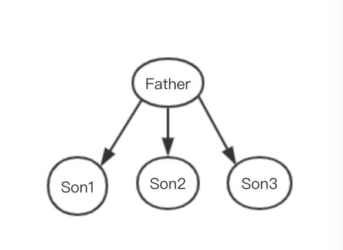

## React与小程序的数据交换

在阅读本文之前，请先阅读[一种让小程序支持JSX语法的新思路](./一种让小程序支持JSX语法的新思路.md)

总的来说，Alita生成的小程序，在运行期存在两个过程，其所有React的行为，都发生在React过程，React过程结束的时候
会产生每一个组件的uiDes描述，本文讨论的就是这些uiDes是怎么从React层传递到微信小程序的。


### 实例管理器
通常一个React实例都会存在一个对应的微信小程序实例，React的render在运行的过程中，会给每一个React组件生成一个唯一标示，这个
标示同时会传递给对应小程序，通过这个唯一标示，React实例和微信小程序实例建立其对应关系，他们共同存在于 实例管理器。 

实例管理器建立了React实例和微信小程序实例的关系，下面具体说一下两个实例的数据交换，数据交换的过程主要存在与两个阶段：组件更新阶段，组件初始化阶段。


### 组件更新阶段
出于对性能的考虑，我们希望react层和小程序层数据交互次数能够近可能的少。比如如下的情形：



当父组件Father setState 引起 son1，son2，son3 UI发生改变的时候， 这3个组件增量的uiDes描述数据，需要传递到对应的小程序组件上，最不理想
情况是react层和小程序层交互3次，最初版本的alita（包括1.0.2版本以前）的确是这么做的。 自小程序2.4.0版本提供groupSetData之后，


小程序提供了批量设置数据的功能。现在每次组件`setState`之后， Alita会diff出，所有修改的组件，把他们合并到一个`groupSetData`中。 统一刷新给微信小程序。 
```javascript

father.groupSetData(() => {
      son1.setData(uiDes1)
      son2.setData(uiDes2)
      son3.setData(uiDes3)
})
```    

也就是说在组件更新的时候，我们利用`groupSetData`可以做到本质上React和小程序只交互一次。

### 组件初始化阶段
组件的初始化过程和更新略有不同，更加复杂一些。考虑以下的情况：


在组件初始化阶段，当`react`层计算出所有组件`uiDes`数据的时候，但是此刻小程序实例`L1， L21， L22...L34`还并不存在。所以是没有办法执行如下语句的
```javascript
L1.groupSetData(() => {
      L1.setData(uiDes1)
      L21.setData(uiDes2)
      
      ...
      
      L33.setData(uiDes3)
      L34.setData(uiDes3)
})
```

我们需要首先刷数据给 `L1`, `L1`获取到数据，渲染完成之后，获取到`L21`, `L22`实例，刷数据给`L21`, `L22`，获取`L31`, `L32`。。。
这里的刷数据存在着**时序上的先后**，因为只用当`L1`渲染结束的时候，我们才能获取到`L21`, `L22`实例，才有机会传递`uiDes`。 

这里假定组件树结构有n层，我们最少是可以做到n次 `groupSetData`， 对应这里：

1. 第一次： `L1`
2. 第二次： `L21`， `L22`
3. 第三次： `L31`， `L32`， `L33`， `L34`

Alita尝试过这个方案，在每一层节点渲染完成之后，收集下一层的所以节点，放到`groupSetData`。

在测试了几个业务之后，发现这个方案有两个问题：

1. 一般首屏页面初始会有7，8层，这样会有7，8次`groupSetData`，导致页面`TTI`（首次可交互时间）变长。 
2. 更加严重的是假如后面的组件结构很浅，前面的组件结构很深，会导致后面的组件先渲染完成，造成页面的**抖动**。 

所以最终`Alita`也并没有采用上面的方案。 `Alita`现有方案如下：
 
`Alita`会把所有数据集合到一起`L1`，产生类似如下的结构：

```javascript
var uiDes = {
    // L1 uiDes
    
    
    L21: {
        L31: {
            
        },
        L32: {
            
        }
    },
    
    L22: {
        L33: {
            
        },
        
        L34: {
            
        }
    }
}
```
通过`L1`的一次`setData`，这些数据会通过属性R的形式，传递到每一个组件，渲染出`L1， L21， L22...L34`。这里有个问题，小程序组件（`L1, L21...`）的渲染，即依赖
属性R的值，又依赖setData的uiDes，这会造成一些不可预料的bug， 所以在首次渲染之后，`Alita`会在进行如下的一次数据修正。
```javascript
L1.groupSetData(() => {
      L1.setData(uiDes1)
      L21.setData(uiDes2)
      ...
      L33.setData(uiDes3)
      L34.setData(uiDes3)
})
``` 
由于这次 并没有实际UI的改变，所以耗时有限。 

Alita现有方案只会固定的执行交互一次。另外由于所有组件在一次`setData`里面完成，故而不会有抖屏。

修正数据的这一次groupSetData 可以**延迟**调用吗？即和下一次setState合并，其实是可以的，这样的好处是节省了一次groupSetData。但是实际运行测试情况表明，这样
做了以后，在FlatList里面存在着闪屏现象。所以最终的方案还是初始结束以后，就给子孙节点修正数据。


