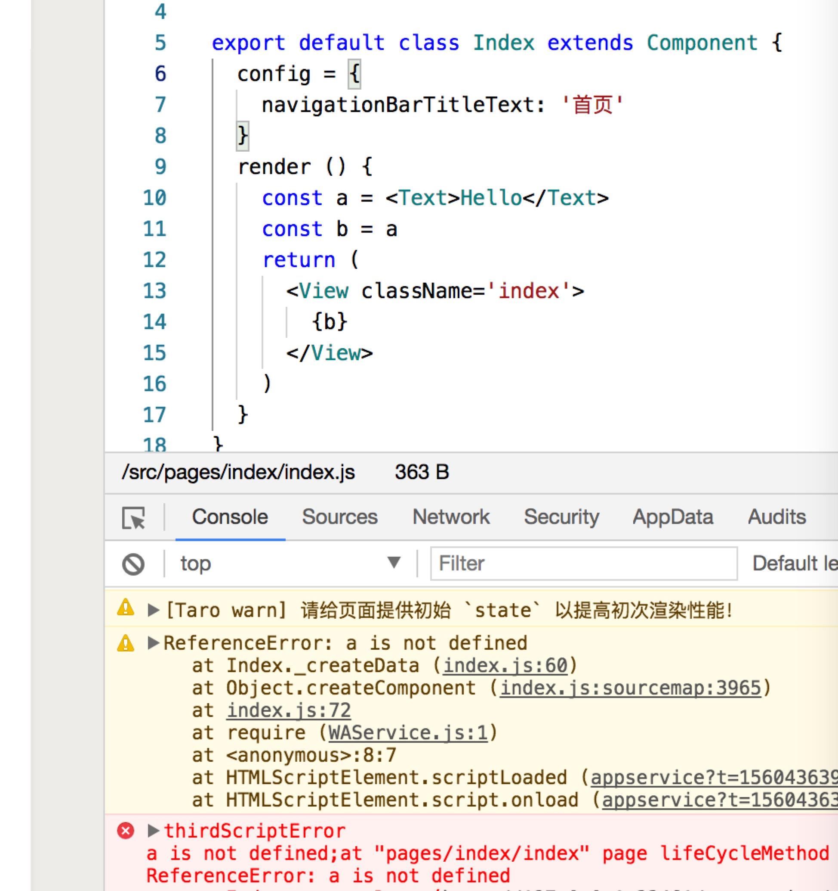
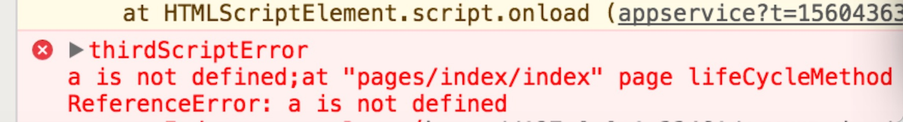
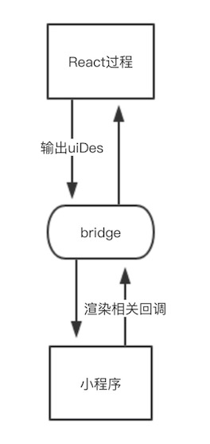

## 一种让小程序支持JSX语法的新思路

`React`社区一直在探寻使用`React`语法开发小程序的方式，其中比较著名的项目有`Taro`，`nanachi`。而使用`React`语法开发小程序的难点主要就是在`JSX`语法上，`JSX`本质上是`JS`，相比于小程序静态模版来说太灵活。本文所说的新思路就是在处理`JSX`语法上的新思路，这是一种更加动态的处理思路，相比于现有方案，基本上不会限制任何`JSX`的写法，让你以**真正的React方式**处理小程序，希望这个新思路可以给任何有志于用`React`开发小程序的人带来启发。

### 现有思路的局限
在介绍新的思路之前，我们先来看下`Taro（最新版1.3）`，`nanachi`是怎么在小程序端处理`JSX`语法的。简单来说，主要是通过在**编译阶段**把`JSX`转化为等效的小程序`wxml`来把`React`代码运行在小程序端的。
 
举个例子，比如`React`逻辑表达式：

```
xx && <Text>Hello</Text>
```
将会被转化为等效的小程序wx:if指令：

```
<Text wx:if="{{xx}}">Hello</Text>
```

这种方式把对`JSX`的处理，主要放在了**编译阶段**，他依赖于**编译阶段**的**信息**收集，以上面为例，它必须识别出逻辑表达式，然后做对应的`wx:if`转换处理。

那**编译阶段**有什么问题和局限呢？我们以下面的例子说明：

```javascript
class App extends React.Component {
    render () {
        const a = <Text>Hello</Text>
        const b = a

        return (
            <View>
                {b}
            </View>
        )
    }
}
```
首先我们声明 `const a = <Text>Hello</Text>`，然后把`a`赋值给了`b`，我们看下最新版本`Taro 1.3`的转换，如下图：



这个例子不是特别复杂，却报错了。

要想理解上面的代码为什么报错，我们首先要理解**编译阶段**。本质上来说在编译阶段，代码其实就是‘字符串’，而**编译阶段**处理方案，就需要从这个‘字符串’中分析出必要的信息（通过`AST`，正则等方式）然后做对应的等效转换处理。

而对于上面的例子，需要做什么等效处理呢？需要我们在**编译阶段**分析出`b`是`JSX`片段：`b = a = <Text>Hello</Text>`，然后把`<View>{b}</View>`中的`{b}`等效替换为`<Text>Hello</Text>`。然而在**编译阶段**要想确定`b`的值是很困难的，有人说可以往前追溯来确定b的值，也不是不可以，但是考虑一下 由于`b = a`，那么就先要确定`a`的值，这个`a`的值怎么确定呢？需要在`b`可以访问到的作用域链中确定`a`，然而`a`可能又是由其他变量赋值而来，循环往复，期间一旦出现不是简单赋值的情况，比如函数调用，三元判断等运行时信息，追溯就宣告失败，要是`a`本身就是挂在全局对象上的变量，追溯就更加无从谈起。

所以在**编译阶段** 是无法简单确定`b`的值的。

我们再仔细看下上图的报错信息：`a is not defined`。 



为什么说`a`未定义呢？这是涉及到另外一个问题，我们知道`<Text>Hello</Text>`，其实等效于`React.createElement(Text, null, 'Hello')`，而`React.createElement`方法的返回值就是一个普通`JS`对象，形如

```javascript
// ReactElement对象
{
   tag: Text,
   props: null,
   children: 'Hello'
   ...
}
```
所以上面那一段代码在`JS`环境真正运行的时候，大概等效如下：

```javascript
class App extends React.Component {
    render () {
        const a = {
            tag: Text,
            props: null,
            children: 'Hello'
            ...
        }
        const b = a

        return {
            tag: View,
            props: null,
            children: b
            ...
        }
    }
}
```

但是，我们刚说了编译阶段需要对`JSX`做等效处理，需要把`JSX`转换为`wxml`，所以`<Text>Hello</Text>`这个`JSX`片段被特殊处理了，`a`不再是一个普通`js`对象，这里我们看到`a`变量甚至丢失了，这里暴露了一个很严重的问题：**代码语义被破坏了**，也就是说由于编译时方案对`JSX`的特殊处理，真正运行在小程序上的代码语义并不是你的预期。这个是比较头疼。


### 新的思路
编译时解决方案，更加像一个增强的模版，只要你遵循相关约定和语法限制，从工程角度来说完全是可以构建出完整的应用的。但是站在更高的抽象上，React带来的本身就是对UI的重新思考，无论是`UI as code`，还是`React is "value UI"`。


下面我们介绍一种全新的处理思路，这种思路在小程序运行期间和真正的`React`几无区别，不会改变任何代码语义，`JSX`表达式只会被处理为`React.createElement`方法调用，实际运行的时候就是普通`js`对象，最终通过其他方式渲染出小程序视图。下面我们仔细说明一下这个思路的具体内容。

第一步：给每个独立的`JSX`片段打上唯一标识`tempName`，假定我们有如下代码：

```javascript
const a = <Text tempName="000001">Hello</Text>

const y = <View tempName="000002">
	<Image/>
    <Button/>
    <Icon/>
    <Text/>
</View>
```
我们给`a`片段，`y`片段 添加了`tempName`属性（这里的`<Image/>`，` <Button/>`， `<Icon/>` 并没有添加`tempName`属性，因为他们不是独立的JSX片段）。


第二步：把`React`代码通过`babel`转义为小程序可以识别的代码，例如`JSX`片段用等效的`React.createElement`替换等

```javascript
const a = React.createElement(Text, {
  tempName: "000001"
}, "Hello");
```

第三步：提取每个独立的`JSX`片段，用小程序`template`包裹，`template`的name属性就是上文的`tempName`值，生成`wxml`文件

```html
<template tempName="000001">
	<Text>Hello</Text>
</template>

<template tempName="000002">
	<View>
		<Image/>
		<Button/>
		<Icon/>
		<Text/>
	</View>
</template>


<!--占位template-->
<template is="{{uiDes.tempName}}" data="{{...uiDes}}"/>
```
最后，需要在结尾生成两个固定模版（稍后会解释这两个模版的作用）：

```html
<!--变量childrentemplate-->
<template name="childTemp">
   <block wx:if="d 是字符串">{{d}}</block>
   <template wx:elif="{{d.tempName}}" is="{{d.tempName}}" data="{{...d}}"/>
   <block wx:else>
       <block wx:for="{{d}}" wx:key="key">
           <block wx:if="{{item 是字符串}}">{{item}}</block>
           <template wx:else is="{{item.tempName}}" data="{{...item}}"/>
       </block>
   </block>
</template>

<!--最终渲染template-->
<template is="{{uiDes.tempName}}" data="{{...uiDes}}"/>
```

第四步：修改`ReactDOM.render`的递归（`React 16.x`之后，不在是递归的方式）过程，递归执行阶段，聚合`JSX`片段的`tempName`属性，生成并返回`uiDes`数据结构。

第五步：把第四步生成的`uiDes`，传递给小程序环境，小程序把`uiDes` 设置给固定模版`<template is="{{uiDes.tempName}}" data="{{...uiDes}}"/>`，渲染出最终的视图。

我们以上面的`App`组件的例子来说明整个过程，首先`js`代码会被转义为：

```javascript
class App extends React.Component {
	render () {
	    const a = React.createElement(Text, {tempName: "000001"}, "Hello");
	    const b = a
	    
	    return (
	      React.createElement(View, {tempName: "000002"} , b);
	    )
	  }
}
```

同时生成`wxml`文件：

```html
<template name="000001">
	<Text>Hello</Text>
</template>

<template name="000002">
	<View>
		<template is="childTemp" data="{{d: child0001}}"/>
	</View>
</template>

<!--变量childrentemplate-->
<template name="childTemp">
   <block wx:if="d 是字符串">{{d}}</block>
   <template wx:elif="{{d.tempName}}" is="{{d.tempName}}" data="{{...d}}"/>
   <block wx:else>
       <block wx:for="{{d}}" wx:key="key">
           <block wx:if="{{item 是字符串}}">{{item}}</block>
           <template wx:else is="{{item.tempName}}" data="{{...item}}"/>
       </block>
   </block>
</template>

<!--最终渲染template-->
<template is="{{uiDes.tempName}}" data="{{...uiDes}}"/>
```

使用我们定制之后`render`执行`ReactDOM.render(<App/>, parent)`。在`render`的递归过程中，除了会执行常规的创建组件实例，执行生命周期之外，还会额外的收集执行过程中组件的`tempName`标识，最终生成 `uiDes` 对象

```javascript
const uiDes = {
	tempName: "000002",
	
    child0001: {
   	    tempName: "000001",
   	    ...
   }
   
   ...
}
```

小程序获取到这个`uiDes`，设置给模版`<template is="{{uiDes.tempName}}" data="{{...uiDes}}"/>`。 最终渲染出小程序视图。

到这里我们已经知道了`<template is="{{uiDes.tempName}}" data="{{...uiDes}}"/>`这个模版的作用，它会根据`uiDes`渲染出最终结构。 

下面我们以这里的b变量，来具体说一下`childTemp`这个模版。运行期我们并不知道b的类型是什么，它可能是简单的字符串，也可能是JSX片段，也可能是数组，更有甚者第一次
render的时候b是字符串，下一次`render`变成JSX片段了，所以当JSXElement的children出现"变量值"的时候，都会将其统一设置为`<template is="childTemp" data="{{d: [somedata]}}"/>`。
这个`childTemp`具体在运行期渲染出什么样的结构，有运行期`b`的值确定。 我们现在来仔细看下`childTemp`： 

```javascript
<template name="childTemp">
   <block wx:if="d 是字符串">{{d}}</block>
   <template wx:elif="{{d.tempName}}" is="{{d.tempName}}" data="{{...d}}"/>
   <block wx:else>
       <block wx:for="{{d}}" wx:key="key">
           <block wx:if="{{item 是字符串}}">{{item}}</block>
           <template wx:else is="{{item.tempName}}" data="{{...item}}"/>
       </block>
   </block>
</template>
```

它会对字符串，JSX片段，数组分别处理， 这就是`childTemp`这个模版的作用。 


在这整个过程中，你的所有`JS`代码都是运行在`React过程`中的，**语义完全一致**，`JSX`片段也不会被任何特殊处理，只是简单的`React.createElement`调用，另外由于这里的`React过程`只是纯`js`运算，执行是非常迅速的，通常只有几ms。最终会输出一个`uiDes`数据到小程序，小程序通过这个`uiDes`渲染出视图。



现在我们在看之前的赋值`const b = a`，就不会有任何问题了，因为`a` 不过是普通对象。另外对于常见的**编译时方案的限制**，比如任意函数返回`JSX`片段，动态生成`JSX`片段，`for`循环使用`JSX`片段等等，都可以完全解除了，因为`JSX`片段只是`js`对象，你可以做任何操作，最终`ReactDOM.render`会搜集所有**执行结果的片段**的`tempName`标识，生成`uiDes`，而小程序会根据这个`uiDes`数据结构渲染出最终视图。

可以看出这种新的思路和以前**编译时**方案还是有很大的区别的，对`JSX`片段的处理是动态的，你可以在任何地方，任何函数出现任何`JSX`片段, 最终执行结果会确定渲染哪一个片段，只有执行结果的片段的`tempName`会被写入`uiDes`。这和**编译时**方案的静态识别有着本质的区别。

### 结语
欢迎你基于这个思路，构造出自己的**React小程序开发方案**。

Alita除了使用这个运行时方案之外，还做了其他很多方面的优化。 我们后续会一一剖析。 


