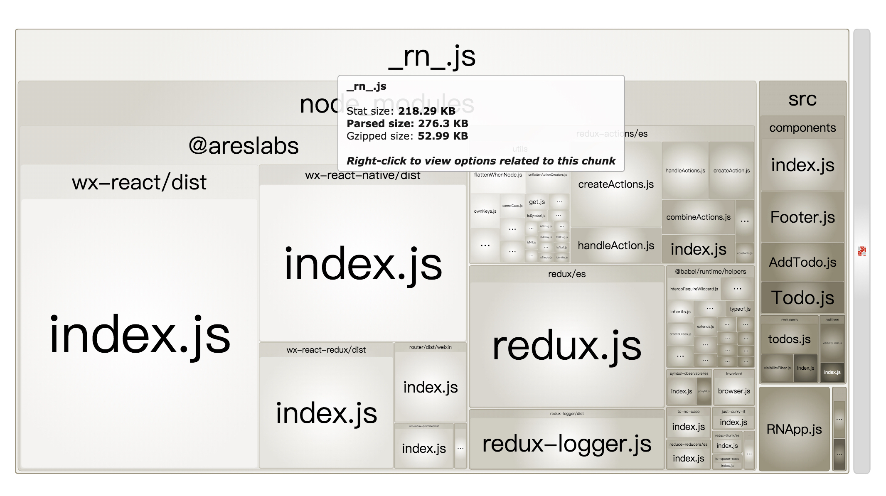

## 基于webpack构建
自2.x版本以后，`Alita`改为基于`webpack`打包构建，借助于`webpack`的特性，2.x版本的`Alita`更加简单易用。

### 完善npm包支持
微信小程序有一套自己的`npm`包使用方式，这种方式并不完全和官方`npm`兼容，这会导致很多常见的包不能直接在小程序平台使用。比如很多包都是以如下的方式提供

```javascript
if (process.env.NODE_ENV === 'production') {
  module.exports = require('./index.production.min.js');
} else {
  module.exports = require('./index.development.js');
}
```
但是微信小程序平台并不支持`process.env.NODE_ENV`，导致以上的包无法使用，会报错`Uncaught ReferenceError: process is not defined`。

另外小程序怪异的`npm`包使用方式，要求其在安装之后手动执行`npm构建`过程，这给本地开发调试包带了很多麻烦。

`Alita`基于`webpack`的打包等于是移除了对小程序`npm`能力的依赖，整个打包过程更加可控。另外借助于`webpack`灵活的`loader/plugin`机制，可以实现诸多常见特性。比如借助`DefinePlugin`插件就可以处理`process.env.NODE_ENV`，实现在开发模式/生产模式下加载不同包的需求。

```javascript
new webpack.DefinePlugin({
  'process.env.NODE_ENV': JSON.stringify(process.env.NODE_ENV)
});
```
### 小程序体积分析及优化
我们知道微信小程序的体积是有限制的，不能超过2M。通过`Alita`运行的小程序上当然也有这样的限制，好在`webpack`内置了`tree-shaking`，但是仍然会有体积超过2M的情况，此时如何减少小程序大小呢？首先需要知道每一个文件、每一个包占据了多少空间。借助`webpack`的`BundleAnalyzerPlugin`插件（`Alita`内置了这个插件），事情变得非常简单，只需要在执行`Alita`打包命令的时候添加 
`--analyzer` 参数即可。下面是`Alita`提供的案例代码`Todo`，添加`--analyzer` 参数之后的大小分布结构。


有了这份大小分布图，优化变得有的放矢。这里`lodash`库占据了很多空间，有500多KB。实际上，通过分析发现只有`redux-promise`引用了`lodash` ,使用了个别的`lodash`库方法，我们可以发布一个简单的包 `redux-promise-nolodash` 替换一下即可。再次执行 `alita --analyzer` ，结果如下，`bundle`的大小由700多KB，降到了200多KB：



上面的方式，需要手动把代码中对`redux-promise`的引用改为`redux-promise-nolodash`，当文件很大项目已经成熟的时候，显然不太方便。更简单的，由于`Alita`基于`webpack`构建打包，所以`webpack`的配置字段基本上可以在`Alita`的配置文件中复用，只需要配置`resove alias` 字段即可：

```javascript
module.exports = {
    resolve: {
        alias: {
            "redux-promise": "redux-promise-nolodash",
        }
    }
}
```
### 一键自动小程序分包
有时当小程序越发复杂的时候，体积的确是需要超过2M的，此外为了减少首屏加载时长，需要减少初次加载的内容。这就需要使用到分包的能力，使用分包以后小程序体积可以支持到12M。小程序的分包如下： 


小程序要求你在分包的时候，主从包的依赖必须手动管理好，比如分包A不能依赖分包B的代码，当业务越发复杂，每一个模块之间的依赖关系将变的特别复杂，这给小程序原生的手动分包带来了很多麻烦，比如我们必须手动把共用依赖提取到主包中维护等诸如此类。 

但是，管理模块依赖是`webpack`的**强项**！`webpack`很早就有提取公共模块拆分包的插件`CommonsChunkPlugin`，`webpack4.0`以后更是提供了更加强大的`SplitChunkPlugin`，基于`SplitChunkPlugin`插件`Alita`实现了非常易用的自动分包。比如：

```javascript
<Router>
    <Route key={"A"} component={A}/>
    
    <Route subpage={'sub1'} key={"B"} component={B}/>
    <Route subpage={'sub1'} key={"C"} component={C}/>
    
    <Route subpage={'sub2'} key={"D"} component={D}/>
    <Route subpage={'sub2'} key={"E"} component={E}/>
</Router>
```
只需要在路由配置中添加`subpage`属性即可！如上的配置，`Alita`将把你的目标小程序分成3个包：主包包含A页， sub1分包保护B，C页，sub2包含D，E页。共用依赖模块将会被提取到主包，而B，C单独依赖模块项将只会在sub1分包存在，整个过程不需要任何的手动干预，也不需要开发者自己去管理模块直接的依赖关系。 

借助于`webpack`灵活的`plugin/loader`机制，整个`Alita`构建打包的过程更加可控，扩展功能更加方便。官方及社区丰富的插件，也帮助我们实现了自动分包，包体积分析优化等诸多功能。