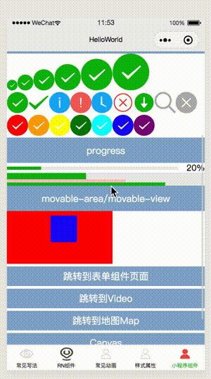
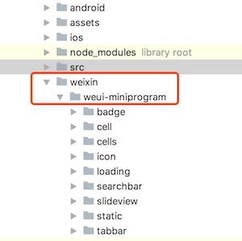

## 小程序内置组件&自定义组件的使用

为了复用现有的小程序能力，Alita支持直接使用小程序内置组件包括小程序自定义组件。这样你就可以使用更加灵活的JSX方式来使用小程序生态，扩展小程序能力。


样例 [HelloWorldRN](https://github.com/areslabs/alita/tree/master/examples/HelloWorldRN)效果



下面我们来看下具体的使用

### 平台判断
首先，无论是对小程序内置组件还是对小程序自定义组件的使用，都是只会在小程序平台生效，所以需要平台判断，和`ReactNative`一样，一般有两种方式： 文件内判断和建立平台文件

文件内判断：

```
if (Platoform.OS === 'wx') {
	return <view>小程序的view</view>  // <-- 直接使用小程序组件
} else {
	return <View><Text>RN的View</Text></View>  // <-- 使用RN组件
}

```

通常我们更加建议，建立平台文件的方式，即建立单独的小程序`.wx`后缀文件，比如你有一个3端的地图组件，那么你可能会有3个文件： `Map.ios.js Map.android.js  Map.wx.js`


### JSX形式使用小程序组件
下面我们说明一下以JSX形式使用小程序组件和原本小程序wxml开发的区别，如果你是React/ReactNative开发者，那么下面要说明的方式，你将非常熟悉，可以直接跳过这一段。

#### 属性绑定
JSX的绑定数据是通过JSX表达式来完成的，JSX表达式包含在`{}`内。 

以小程序`button`为例

```javascript
<button
    type="primary"
    size={this.state.size}
    bindtap={() => {
        console.log('我被点击了！')
    }}
>
    点击我
</button>
```
注意这里的`size`，`bindtap`。 `size`由组件的`state`控制，所以`size={this.state.size}`， 你可以通过`this.setState({size: xx})`， 来修改这里`button`组件的大小； `bindtap`是组件点击的回调，所以需要传递一个方法。

#### 条件/数组渲染

在小程序开发方式里面有 条件渲染，数组渲染的概念，这些在JSX里面都是朴素的JS语句。

比如条件渲染： 

```javascript
condition && <view/>;

condition ? <view>1</view> : <view>2</view>
```

比如数组渲染：

```javascript
arr.map(item => <view>{item}</view>)
```

数组+条件渲染

```javascript
arr.map(item => {
	return item ? <view>1</view> : <view>2</view>
})
```


#### 模版
同样的小程序的模版`template`，在JSX的世界也是不存在的。不过，你可以通过JSX做出任何UI组合

```
class A extends React.Component {

	getIcons(txt) {
		return <view>{txt}<view>
	}

	render() {
		return (
			<view>
				{
					this.state.condition && <view>Hello</view>
				}
				
				{
					this.getView(this.state.txt)
				}
			</view>
		)
	}
}
```

总的来说，JSX本质上是JS，相对小程序wxml的方式更加灵活，他让你以**编程**的思维去构建UI，这是一种图灵完完备的方式。

### 小程序自定义组件
Alita在编译打包的过程中，会把项目下的`weixin`目录`copy`到小程序目录，我们可以把小程序自定义组件放置这这个目录下，以微信官方组件库[`weui-miniprogram`](https://github.com/wechat-miniprogram/weui-miniprogram)为例，目录结构如下：



另外，还需要在[配置文件alita.config.js](https://areslabs.github.io/alita/%E9%85%8D%E7%BD%AE%E6%96%87%E4%BB%B6.html) 配置自定义组件的路径：

alita.config.js

```javascript

module.exports = {
	 // 其他配置
	 。。。。

   	 //小程序自定义组件	
    miniprogramComponents: {
        "badge": "/weixin/weui-miniprogram/badge/badge",
        "cell": "/weixin/weui-miniprogram/cell/cell",
        "cells": "/weixin/weui-miniprogram/cells/cells",

        // 防止和小程序内置icon重复
        "mp-icon": "/weixin/weui-miniprogram/icon/icon",

        "loading": "/weixin/weui-miniprogram/loading/loading",
        "searchbar": "/weixin/weui-miniprogram/searchbar/searchbar",
        "slideview": "/weixin/weui-miniprogram/slideview/slideview",
        "mp-tabbar": "/weixin/weui-miniprogram/tabbar/tabbar"
    }
}
```

这样配置了以后，就可以直接用React方式来使用这些组件了。

```javascript
<mp-icon type="add" size="25"/>
```

样例 [HelloWorldRN](https://github.com/areslabs/alita/tree/master/examples/HelloWorldRN) 自定义组件页面效果：


### 受控组件
我们期望`data`和`UI`能建立一一对应的关系：`UI = f(data)`，这样我们就可以把对`UI`的操作转化为更加简单的`data`操作，同时`data`也可以实时映射`UI`。 

对于 `input`，`slider`，`textarea`这类组件，通常内部保留着一个状态，这个状态随着用户的输入而改变，但是在React中，状态是保存在`state`里的，对状态的改变需要调用`setState`。这种情况下，当把`state`作为状态的唯一来源的时候，就叫做“受控组件”


看个例子： 

```
class A extends Component {

	state = {
		val: ''
	}

	render() {
		return <input 
			value={this.state.val}
			bindinput={(e) => {
				console.log('val:', e.detail.value
			}}
		/>
	}
}
```

在上面的`input`输入值的时候，`input`的内容会变化吗？

在`React`上`input`的内容无论你怎么输入都是不会变化的，因为`value={this.state.val}` 其中`this.state.val`并没有变化，所以无论怎么输入，`input`的内容都不会变化，如果需要内容跟随输入变化，那么必须去修改相应的`value`值：

```
class A extends Component {

	state = {
		val: ''
	}

	render() {
		return <input 
			value={this.state.val}
			bindinput={(e) => {
				this.setState({
					val: e.detail.value   // <-- 修改相应的value值
				})
			}}
		/>
	}
}
```


不过需要注意的是，在小程序上不执行setState的时候，input的内容也是会变化的，我们还是建议以React的处理方式来执行，当提供了value属性的时候，保持组件状态和value一致。

### 其他

#### 样式
`ReactNative`只支持`style`定义组件的方式，同样我们在使用小程序组件的时候，也只支持`style`形式。 下面是一个常见的`style`写法

```
<view
	style={{
		height: 50,
		width: 50
	}}
/>
```

这里的`style`属性接收`Object`类型的值，这恰好符合[`yoga`](https://github.com/facebook/yoga)(`ReactNative`布局系统)的计算参数。 

不过，对于小程序组件来说，我们新增了`style`属性为字符串的支持。 也就是说，你完全可以： 

```
<view
	style="height: 50px; width: 50px;"
/>
```

#### 图片
和`ReactNative`一样，当我们需要使用图片的时候，需要使用`require`或者`import`导入图片，比如地图`map`组件 `marker`属性的`iconPath` 字段


原本小程序开发的时候，你只需要提供字符串的形式的图片地址， 但是现在你需要提供`require(iconPath)` 形式的图片， 比如下面的`marker` 值：

```javascript
markers: [
    {
        iconPath: require("./alita.jpg"),  // <--- require(string)
        id: 0,
        latitude: 23.099994,
        longitude: 113.324520,
        width: 50,
        height: 50
    },
],
```
 


