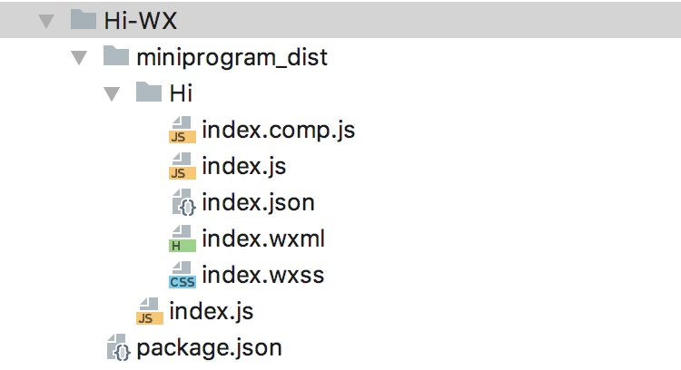

## 自定义组件库扩展
除了React Native本身提供的组件， 每个项目每个团队一般都会有自己的UI组件库。 
此外，有很多优秀的第三方组件比如：[ScrollableTabView](https://github.com/ptomasroos/react-native-scrollable-tab-view)， [ViewPager](https://github.com/race604/react-native-viewpager)等， 如何把使用了这些组件的React Native应用转化为微信小程序呢？

下面我们提供2种方式，来处理这些组件，我们以实际的例子说明。 

以下所涉及的`@areslabs/hi-rn`, `@areslabs/hi-wx`, `@areslabs/hello-rn`, `@areslabs/hello-wx`。 代码均可以在packages目录下找到
### 手动对齐UI组件库
首先， 我们需要预先在微信小程序端 对齐一套对应的组件。为了方便说明，我们以第三方组件`@areslabs/hi-rn`为例， 这个组件很简单，希望通过这个例子，能够让大家理解扩展第三方组件库的方式。 这个组件的RN，微信小程序源代码都在packages目录下。

我们先来看一下RN组件代码
```javascript
export default class Hi extends React.Component {
    render() {
        return (
            <View style={this.props.style}>
                <Text
                    style={this.props.textStyle}
                    onPress={() => {
                        console.log('Hi ', this.props.name, ' !')
                        this.props.textPress && this.props.textPress()
                    }}
                >Hi {this.props.name}!</Text>
            </View>
        )
    }
}
```
这个组件接受一个属性name， 并展示。 

再看下对齐的微信小程序的代码， 先看下目录结构


首先这个包要符合微信小程序npm包的[约定](https://developers.weixin.qq.com/miniprogram/dev/devtools/npm.html)。 代码需要在miniprogram_dist 目录下。 

分别来看下必要的几个文件 index.comp.js ，index.js， index.json, index.wxml ,index.wxss。 

#### index.comp.js
代码如下： 
```javascript
import {RNBaseComponent, tackleWithStyleObj, styleType} from '@areslabs/wx-react'
const {VIEW} = styleType

export default class Hi extends RNBaseComponent{
    getStyle(props) {
        return {
            style: tackleWithStyleObj(props.style, VIEW),
            textStyle: tackleWithStyleObj(props.textStyle),
        }
    }
}
```
这个文件是由转化引擎内部的mini-react运行时用的， 有两点需要注意
1. 继承自RNBaseComponent
2. 提供getStyle 方法

继承自RNBaseComponent是为了方便，转化引擎内部的识别。

重点在于这里的getStyle 方法，在说getStyle之前，先说两点。

1. `tackleWithStyleObj`方法，顾名思义`tackleWithStyleObj`就是把RN的样式对象，转化为微信小程序的等效样式的方法，它接受2个参数，第一个参数是RN合法的样式对象（可以是数组），第二个参数决定了需要添加的样式默认值。
2. 微信小程序的自定义组件和RN 有一个很大的不同， RN的自定义组件实际上只存在于React过程阶段，比如Hi组件，在React真正渲染之后是不存在的，而微信小程序会实实在在渲染出一个Hi节点。

所以，在小程序上我们需要把组件Hi的外层View的样式提取出来，放到Hi节点上，也就是`style: tackleWithStyleObj(props.style, VIEW)`。 而内部文字的样式，也需要通过`tackleWithStyleObj`转化一次即：`textStyle:tackleWithStyleObj(props.textStyle),`。 注意这里style的时候使用了tackleWithStyleObj的第二个参数，原因是我们无法给Hi节点，添加样式默认值，而对应内部对齐使用的微信原生节点，是可以通过如下方式添加默认值的。
```css
page, view, image, scroll-view {
    display: flex;
    flex-direction: column;
    position: relative;
    ...
}
```

#### index.js
代码如下：
```javascript
import {getPropsMethod, instanceManager} from '@areslabs/wx-react'

Component({
    properties: {
        name: null,
        textStyle: null,
        diuu: null,
    },

    attached() {
        instanceManager.setWxCompInst(this.data.diuu, this)
    },

    detached() {
        instanceManager.removeUUID(this.data.diuu)
    },

    methods: {
        handlePress: function () {
            console.log('Hi ', this.data.name, ' !')
            const textPress = getPropsMethod(this, 'textPress')
            textPress && textPress()
        }
    }
});
```
properties 字段定义了组件需要的属性，这里需要额外定义一个属性： diuu， 同时在微信小程序的生命周期里面需要使用这个这个diuu属性， 即attached 生命周期执行` instanceManager.setWxCompInst(this.data.diuu, this)`， detached 生命周期`instanceManager.removeUUID(this.data.diuu)`。 
另外在methods字段里面， 提供了handlePress方法，对应Text标签的onPress，由于微信小程序不可以直接传递方法， 对于 `this.props.textPress`需要调用`getPropsMethod` 获取对应方法

style属性不需要定义在properties？首先没必要，因为样式需要设置在微信小程序自定义组件生成的外部节点上，第二设置了也没有用， 微信小程序传递属性的时候，自动过滤了style。


#### index.wxml
代码如下： 
```html
<view class="fillout">
     <view style="{{textStyle}}" catchtap="handlePress">Hi {{name}}!</view>
</view>
```
这里有几点需要注意的
1. React Native的Text组件行为表现，更像微信小程序的view标签， 这里用view标签替换Text标签
2. React Native的事件在嵌套的时候是不冒泡的，也就是Touchable组件嵌套Touchable组件在响应的时候只有内部响应， 所以这里用catchtap， 这里的handlePress和上面index.js文件里的handlePress是对应的
3. React Native 的数据绑定`{this.props.name}` 对应微信小程序的` { { name } } `。
4. 正如之前所说，style会被设置到自定义组件生成的节点之上，所以里面包裹的view需要撑满这个自定义节点， 需要设置fillout类

微信小程序自定义组件生成的节点，本身也是一个view节点，它即被设置了style的值，也就和React Native的包裹的View节点等效了，所以这里的包裹view节点可以省略。 

实际上的index.wxml的代码如下： 
```html
<view style="{{textStyle}}" catchtap="handlePress">Hi {{name}}!</view>
```
#### index.json
代码如下： 
```json
{
  "component": true
}
```

#### index.wxss
这里放置你在对齐阶段需要用到的wxss文件， 一般情况由于React Native的样式都是设置在style属性， 这个文件通常为空。 
另外为了方便处理样式，微信小程序基本节点 view, image, scroll-view 都被默认设置为了 flex布局，且方向为column，与React Native保持了一致。 


#### 配置文件
对齐之后，发布为[@areslabs/hi-wx](../packages/Hi-WX)npm包。然后在配置文件配置如下： 
```javascript
module.exports = {
    dependenciesMap: {
        ...
        "@areslabs/hi-rn": "@areslabs/hi-wx",
        ...
    },


    extCompLibs: [
        {
            name: '@areslabs/hi-rn',
            compLists: [
                'Hi'
            ]
        }
    ]
}
```
和其他npm包一样， 首先需要在`dependenciesMap`字段里面指明对应关系。 额外的，组件库对齐的包还需要在`extCompLibs`字段，指明提供的所有组件， 对于`@areslabs/hi-rn`这个包， 只有一个组件 Hi

#### 使用方式
以上，我们对一个React Native组件在微信小程序上的适配工作就结束了，对于以后所有使用这个Hi组件的React Native应用来说，就是可以直接转化为微信小程序版本了。 
```javascript
import Hi from '@areslabs/hi-rn'

class HelloWorld extends React.Component {
    render() {
    	return <View>
    	     <Hi name="y5g"/>
    	</View>
    }
}
```
React Native的所有组件包括Image， View， FlatList都是通过以上的方式在微信小程序端实现了对齐， 大家可以通过查看[wx-react-native](https://www.npmjs.com/package/@areslabs/wx-react-native)，来查看基本组件的对齐。 


### 引擎直接转化组件
是不是自己的UI组件库，都需要用以上的对齐方式呢？ 还有一种可选方式。既然我们可以让React Native应用直接运行在微信小程序端， 那么直接把UI组件库用转化引擎处理一次呢？答案是可行的， 我们以 `@areslabs/hello-rn`为例， 其React Native代码如下：
```javascript
export default class Hello extends React.Component {
    render() {
        return (
            <View style={this.props.style}>
                <Text
                    style={this.props.textStyle}
                    onPress={() => {
                        console.log('Hi ', this.props.name, ' !')
                        this.props.textPress && this.props.textPress()
                    }}
                >Hi {this.props.name}!</Text>
            </View>
        )
    }
}
```

然后我们进入代码目录执行
```shell
alita -i ./ -o ../hello-wx/miniprogram_dist
```
这样在`hello-wx`目录就生成了对应的微信小程序Hello组件， 然后我们把miniproram_dist目录下的package.json 文件移动到上层hello-wx目录， 修改其name字段为`@areslabs/hello-wx`, 发布就可以了。
目录结构如下： 


#### 配置文件
```javascript
module.exports = {
    dependenciesMap: {
        "@areslabs/hello-rn": "@areslabs/hello-wx"
    }
}
```
这种方式只需要在`dependenciesMap`字段配置就可以了，不需要在extCompLibs字段指定了。 

#### 使用方式
这种方式对齐的组件在使用的时候，需要引入全路径如`@areslabs/hello-rn/index`（即使是index文件，也不能只引入目录） 
```javascript
import Hello from '@areslabs/hello-rn/index'

class HelloWorld extends React.Component {
    render() {
    	return <View>
    	     <Hello name="y5g"/>
    	</View>
    }
}
```
**这里一定要注意使用 全路径**

### 最后
对于基本UI组件库，我们更加推荐手动对齐的方式， 因为在手动对齐的时候，你可以使用所有微信小程序的原生API/组件， 包括使用动画API等，能力更加的强大，另外手动对齐更加的自由， 你可以针对不同平台做不同的响应。 而且，手动对齐的组件有更出色的性能，当一个组件被频繁使用的时候，更应该采用这种方式。
转化引擎直接转化组件的方式， 更加直接简单，可以用来处理基于基本UI组件库封装的高级组件。


